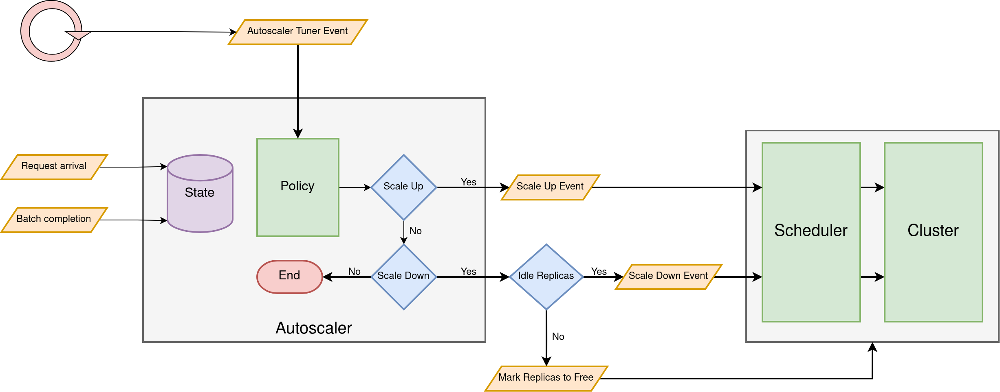
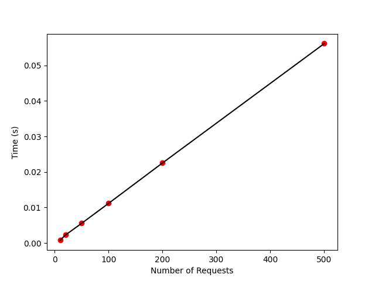
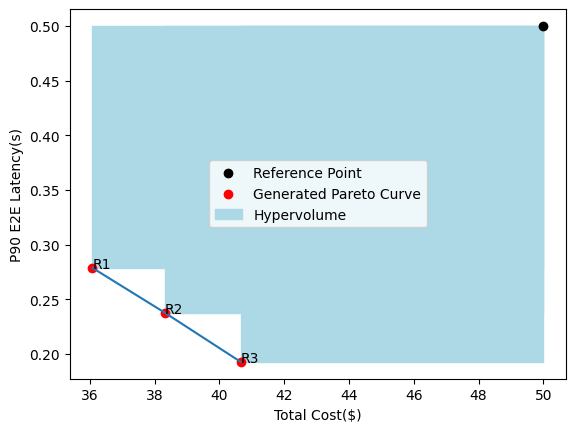
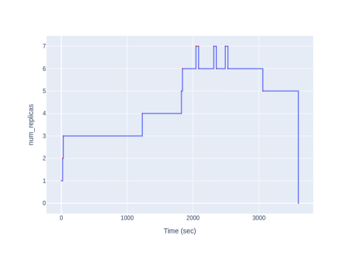
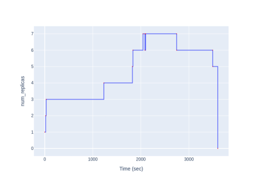
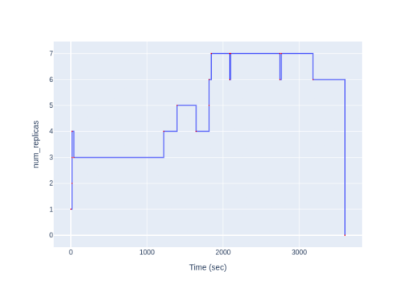
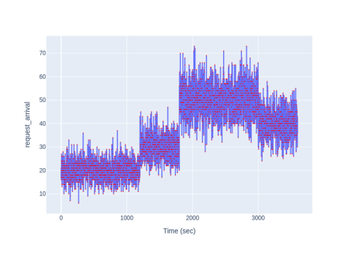

# Lab 3 : Autoscaling in Vidur for Inference Workloads

## Environment Setup
1. Clone the repository
2. Create and activate a Python 3.10 virtual environment
    - `python3.10 -m venv .venv`
    - `source .venv/bin/activate`
3. Install the dependencies
    - `pip install -r requirements.txt`

## Overview

Vidur is a high-fidelity and extensible LLM inference simulator. For lab 3, we have extended Vidur to support autoscaling of worker replicas. You will be implementing the autoscaling policies in Vidur to scale the worker replicas based on the inference workload.

This lab is divided into three parts:
1. Implementing autoscaling aware schedulers
2. Implementing Inferline based autoscaling policy
3. Implementing a custom autoscaling policy

To give a sense of how long it may take to complete each task, we've tagged them with the following labels:
- easy: 30 minutes - 1 hour
- moderate: 1 hour - 5 hours
- hard: 5 hours - 10 hours

However, these are rough estimates and may vary based on your familiarity with the concepts.

## Part 1: Autoscaling aware schedulers (1.5 pts)
The following figure shows the general architecture of the Autoscaler.


### Task 1: Extending RoundRobinGlobalScheduler (0.5 pts) [easy]
In this subtask, you will extend the functionality of the `RoundRobinGlobalScheduler` class, located in `vidur/scheduler/global_scheduler/round_robin_global_scheduler.py`, to handle the scaling down of worker replicas. When the system decides to scale down replicas but finds no idle workers, it must stop routing new requests to the workers that are slated for scaling down. Your task is to implement this behavior by modifying the scheduler to prevent it from assigning new tasks to replicas marked for scaling down

### Task 2: Implementing LOR Scheduler (1 pt) [easy]
In this subtask, you will implement the Least Outstanding Requests Scheduler `LORGlobalScheduler` class, located in `vidur/scheduler/global_scheduler/lor_global_scheduler.py`. This scheduler should assign a new task to the worker with the least number of outstanding requests. You will implement the `schedule` method in the `LORGlobalScheduler` class to achieve this.


When the system decides to scale down replicas but finds no idle workers, it should first mark a replica to be freed up. LOR Scheduler marks the replica with the least number of outstanding requests for scaling down in order to minimize the latency of the scale down process. Implement this behavior in the `mark_replica_to_free` method of the `LORGlobalScheduler` class to achieve this.

This interaction between the autoscaler and the global scheduler is shown through the following figure:


### Hints
1. Note that the provided `RoundRobinGlobalScheduler` is unaware of scale down actions and makes the assumption that replica ids range from 0 to num_replicas-1. However, this doesn't hold in the event of replica scale downs when some replicas get removed from the cluster. Therefore, make sure to use `self._replicas` or `self._replica_schedulers` to cycle through the replica ids.
2. The `mark_replica_to_free` method is required to mark the replica to free (i.e add the identified replica to the `replicas_to_free` set) and also return the marked replica id as hinted through the function return signature.

## Part 2: Inferline based autoscaling policy (9 pts)
### Task 1: Traffic Envelope (3 pts) [moderate]
Inferline uses a reactive autoscaling mechanism to scale up/down replicas during its high frequency tuning phase. Inferline's autoscaling policy is based on the request arrival traffic for the system. The traffic envelope maintains a moving average of the request arrival rate which is used to determine the number of replicas required to handle the incoming requests. In particular, the traffic envelope maintains the maximum request arrival rate over a window of time for a maximum lookback period. The traffic envelope is updated every time a new request arrives to the system. Complete the `NetworkEnvelope` class located in `vidur/autoscaler/inferline_autoscaler.py` to implement the network traffic envelope.

**NOTE**: Since we are working with LLM inference workloads, the request arrival rate is replaced with the request arrival token rate. For a request with `p` prefill tokens and `d` decode tokens, the total number of tokens contributed by the request is ```p + d```. However, we will test your implementation on traces with ```d=1```.

### Task 2: Optimizing the Traffic Envelope Implementation (0 pt) [moderate]
A naive implementation of the traffic envelope can be computationally expensive which could make it impractical for real-world systems. In this subtask, you are required to implement an efficient network traffic envelope for which the time complexity of individual updates and queries are independent of number of requests in the system. While this subtask is ungraded, it is essential to optimize the traffic envelope for executing large traces which may be critical for later parts of the lab.

We have included a test case on gradescope that checks for linear scaling as the number of requests increases. This test case is only for reference and will not be graded. Note that you may have an efficient implementation that does not pass the linear scaling test.


### Task 3: Replica Throughput Estimation (1 pt) [easy]
Inferline estimates the throughput of the system in the low frequency planner phase. This is required to make scale up and scale down decisions by comparing it against the request arrival rates. In this lab, we will estimate the replica token throughput based on the completed batch statistics and use an exponential moving average to smooth the throughput estimates. Complete the `on_batch_end` method in the `InferlineAutoscaler` class located in `vidur/autoscaler/inferline_autoscaler.py` to implement the replica throughput estimation.

### Task 4: Autoscaling (2 pts) [moderate]
In this subtask, you will implement the Inferline based autoscaling policy for the `InferlineAutoscaler` class. In particular, implement the `tune` method that takes the current time as argument and returns the number of replicas to scale up/down. Since we have a single model in the pipeline, so you only need to account for the replica token throughput term and scale accordingly. Therefore, `num target replicas = max token arrival rate / replica token throughput`

### Task 5: Tuning the Autoscaler (3 pts) [moderate]
An autoscaling policy has dual objectives: to maximize the latency SLO attainment and to minimize the cost of running the system. For this subtask, you are required to tune the autoscaler to achieve the good trade-off between the two objectives. Play around with the fields of the `InferlineAutoscalerConfig` in `vidur/config/config.py` to tune the autoscaler. You can test the performance of your autoscaler on a provided synthetic trace by following the instructions in `evaluator/visualize.ipynb`.

*Your submission will be evaluated on the P90 latency and total cost of serving the requests for the test traces. The reference P90 latency and total cost will be visible in the gradescope submission.*

## Part 3: Custom Autoscaling Policy (4.5 pts) [hard]
For this part, you are free to implement any custom autoscaling policy of your choice. You can implement a new autoscaler class or extend the `InferlineAutoscaler` class to implement your custom policy. Similar to the `InferlineAutoscaler` class, you will need to implement the methods `on_request_arrival`, `on_batch_end`, and `tune` to implement your custom autoscaling policy.

As mentioned earlier, an autoscaler has dual objectives: to maximize the latency SLO attainment and to minimize the cost of running the system. A given autoscaling policy generates a single point in the latency-cost trade-off space. However, this may not always be desirable. Ideally, we would like the flexibility to move around in the trade-off space based on differing end-objectives. For this subtask, you are required to implement an autoscaler that generates a Pareto front of latency-cost trade-offs based on a provided service_level config paramemter. We will use the normalized hypervolume score of the Pareto front as a metric to objectively evaluate the performance of the custom autoscaling policy.
#### Normalized Hypervolume Computation
#### Given:
- **Total costs**: $C_1, C_2, \dots, C_n$ (cost values for each Pareto point)
- **End-to-end latencies**: $L_1, L_2, \dots, L_n$ (latency values for each Pareto point)
- **Reference cost**: $C_{\text{ref}}$
- **Reference latency**: $L_{\text{ref}}$

#### Steps:

1. **Normalize costs and latencies**:
```math
\text{Normalized cost: } \hat{C}_i = \frac{\min(C_i, C_{\text{ref}})}{C_{\text{ref}}} \quad \forall i \in [1, n]
```
```math
\text{Normalized latency: } \hat{L}_i = \frac{\min(L_i, L_{\text{ref}})}{L_{\text{ref}}} \quad \forall i \in [1, n]
```

2. **Sort the indices** of the Pareto points based on increasing order of normalized costs $\hat{C}_i$.

3. **Initialize hypervolume** using the last Pareto point:
```math
\text{Hypervolume} = (1 - \hat{C}_n) \cdot (1 - \hat{L}_n)
```

4. **Accumulate hypervolume** for each subsequent point:
```math
\text{For } i = 1 \text{ to } n-1:
```
```math
\text{Hypervolume} += (\hat{C}_{i+1} - \hat{C}_i) \cdot (1 - \hat{L}_i)
```

5. **Return** the final hypervolume score.


Implement the `init_service_level` method in the `CustomAutoscaler` class to initialize the required state based on the service level.

As an illustrative example, consider the following figure that shows the latency-cost trade-off space for different service levels and the hypervolume with respect to a reference cost and latency.



The number of replicas as a function of time for different service levels is shown below.

service Level 1 | service Level 2 | service Level 3 
:----------------------:|:-----------------------:|:-----------------------:
| |  | |

The request arrival rate as a function of time  for the request trace is shown below.


Please refer to the `evaluator/visualize.ipynb` notebook for more details on evaluating your custom autoscaling policy and computing the hypervolume score of the Pareto front.

*Your submission will be evaluated on the normalized hypervolume score of the Pareto front of P90 latency vs total cost of serving requests for the test traces. The reference pareto front and hypervolume score will be visible in the gradescope submission.*

## Debugging Tips
1. Try writing unit tests for the different autoscaler components
2. Steps to initialize the various components
```
python -m vidur.main	# One time step to generate the simulator prediction cache
```
```
from vidur.config.config import ClusterConfig, InferlineAutoscalerConfig, MetricsConfig, SimulationConfig # Imports for config classes
```
```
simulation_config = SimulationConfig() # Initialize Simulation Config
```
```
from vidur.entities.cluster import Cluster

cluster = Cluster(
	cluster_config=simulation_config.cluster_config,
	metrics_config=simulation_config.metrics_config,
	generator_config=simulation_config.request_generator_config,
)	# Initialize Cluster
```
```
from vidur.entities.request import Request

request = Request(arrival_time, num_prefill_tokens, num_decode_tokens) # Initialize request
```
```
from vidur.scheduler.global_scheduler.round_robin_global_scheduler import RoundRobinGlobalScheduler

scheduler = RoundRobinGlobalScheduler(
	simulation_config,
	cluster.replicas,
)	# Initialize Round Robin Scheduler
```
```
from vidur.scheduler.global_scheduler.lor_global_scheduler import LORGlobalScheduler

scheduler = LORGlobalScheduler(
	simulation_config,
	cluster.replicas,
) # Initialize LOR Scheduler
```
```
autoscaler_config = InferlineAutoscalerConfig()	# Initialize Autoscaler Config
```
```
from vidur.autoscaler.inferline_autoscaler import NetworkEnvelope

netowork_envelope = NetworkEnvelope(autoscaler_config) # Initialize Network Envelope
```
```
from vidur.autoscaler.inferline_autoscaler import InferlineAutoscaler

autoscaler = InferlineAutoscaler(autoscaler_config, cluster, scheduler, None) # Initialize Inferline Autoscaler
```
3. End-to-End tests on the simulator (instructions in the evaluator directory) are useful only when the individual components have been implemented

## Submission Guidelines
Run `./submit.sh` to create a `submission.zip` file. Submit the zip file on gradescope.